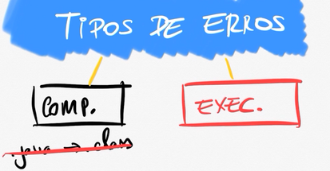
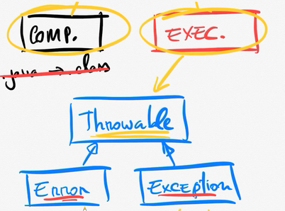
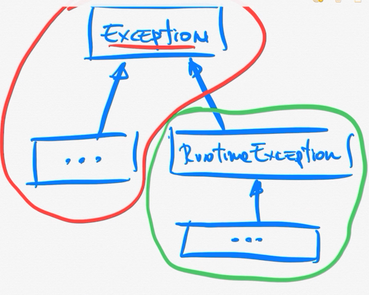
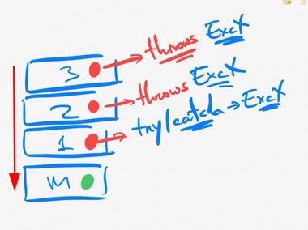

# Tratamento de Erros

Existem erros que podem fazer o programa não funcionar como deveria ou ate mesmo matar o processamento dele.

### Tipos de erros

- **Erros de Compilação** — são erros que o compilador decteta e impede a criação de um executavel.
- **Erros de Tempo de Execução** — são erros que acontecem quando o programa ja esta sendo executado, e acontecem erros previstos pelo programador como: tentar acessar um banco de dados e esse não esta disponivel ou tentar baixar um arquivo mais esta sem internet, etc.

### Erros em JAVA

**Throwable** a class mãe de todos os erros e excessões em java que acontecem em tempo de execução.

- **Error** — é algo mais critico, ele é lançado em algo que não pode ser recuperado. Por exemplo, o OutOfMemoryError acontece quando a aplicação fica sem memória e então o programa simplesmente para.
- **Exception** - é possivel recuperar, podemos tratar o erro.

### Tratamento de Exception

Para tratar as exceptions em java utilizamos o try com catch ou finally.

- **try** — em bloco de codigo que pode gerar erro que podemos aplicar alguma forma de tratamento.
- **catch** - é um bloco de codigo onde vamos capturar e tratar do erro.
- **finally** - é um bloco de codigo que usamos juntamente com o try e o catch, que serve para executar o codigo independentemente de ter houvido um erro e  se o mesmo foi tratado ou não, finally sempre sera executado.   

### Tipos de Exception

- **Checada ou Verificada** — São todas as classes que herdam da class Exception ecepto a RuntimeException. Classes checadas abrigam com que o erro seja tratado no mesmo metodo que a intancio. Quando um metodo não quer tratar um erro e quer passar ele adiante usa o `throws` na assinaturado metodo.

- **Não Checada ou não Verificada** — classe RuntimeException e as suas filhas, permitem passar o tratamento do erro adiante para que outro metodo possa tratalo ou se nao querer nao precisa tratar.

**OBS**: exceptions podem ser a causa de outras exceptions.
